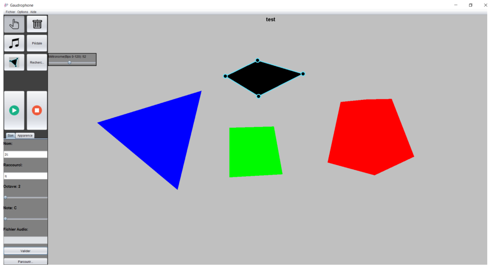

# Gaudrophone

This project was realised during my academic semester at Laval University (Quebec)

Gaudrophone is an app allowing you to build you own music instrument and play with it !

You can choose your own components and sounds! Create your own dream partitions and let the Gaudrophone play.

